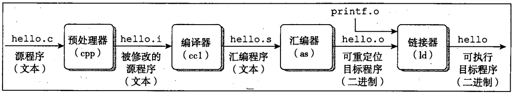

### 程序被其他程序翻译成不同的格式  
    
     
1. 预处理阶段  
  预处理器(cpp)根据以字符#开头的命令，修改原始的C程序。比如hello.c中的```#include<stdio.h>```命令告诉预处理器读取系统头文件stdio.h的内容，并把他直接插入程序文本中。结果就得到了一个C程序，通常是以.i作为文件扩展内容。  
  预处理阶段发生的事情有：展开头文件，把头文件中的内容引入到程序中；#开头的命令的处理，包括宏替换等；一些特殊符号，预处理阶段可以处理一些特殊的符号，例如在源程序中出现的LINE将被解释为当前的行号(十进制数)，FILE则被解释为当前被编译的C源程序的名称，预处理程序对于在源程序中出现的这些串将用合适的值进行替换。  
2. 编译阶段  
  编译器(ccl)将文本文件hello.i翻译成文本文件hello.s,它包含一个汇编语言程序，即将C程序编译成汇编程序。  
3. 汇编阶段  
  接下来汇编器(as)将hello.s翻译成机器语言指令，得到hello.o的文件，hello.o是一个二进制文件。  
4. 链接阶段  
  比如hello程序调用了printf函数，它是每个C编译器都会提供的标准C库函数，printf函数存在于一个名为printf.o的单独预编译好了的文件中，而这个文件必须以某种方式合并到我们的hello.o程序中，这就是链接器(ld)需要做的事情。结果就得到一个hello文件，它是一个可执行文件，可以被加载到内存中，由系统执行。  
